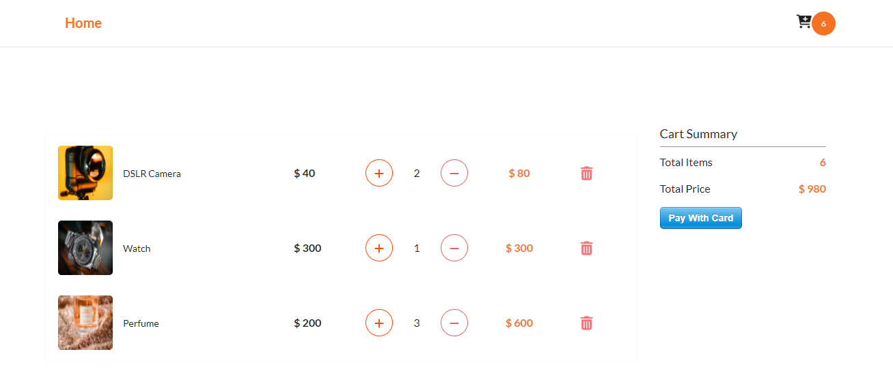
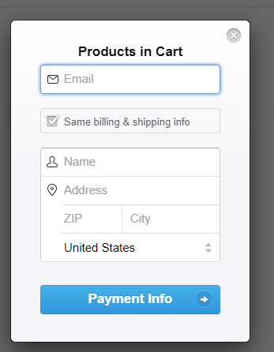

# E-Commerce_React
Here, is project of E-commerce website, where user can buy things, Can see and modify cart details & at the end can use payment getway as well.  With help of react and  context + router.

FYI : For Payment Stripe is not fully working. 


After npm-start ---> Visit : http://localhost:3000/


Please, refer below screenshots for better understanding.
## Screenshots


#### Home Page


#### Cart


#### Payment



## Installation

Install project with npm

```bash
  npm install react-scripts
  npm start 
```
    
